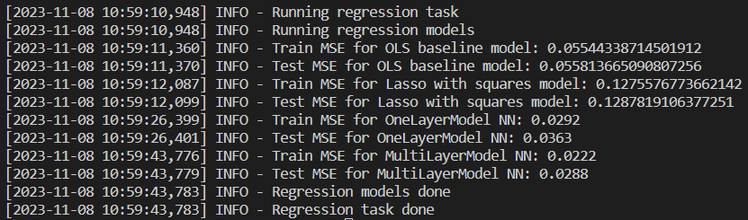
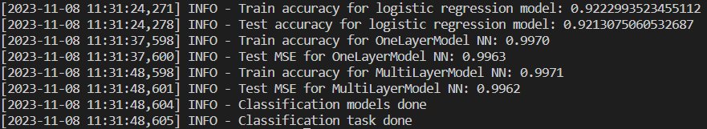
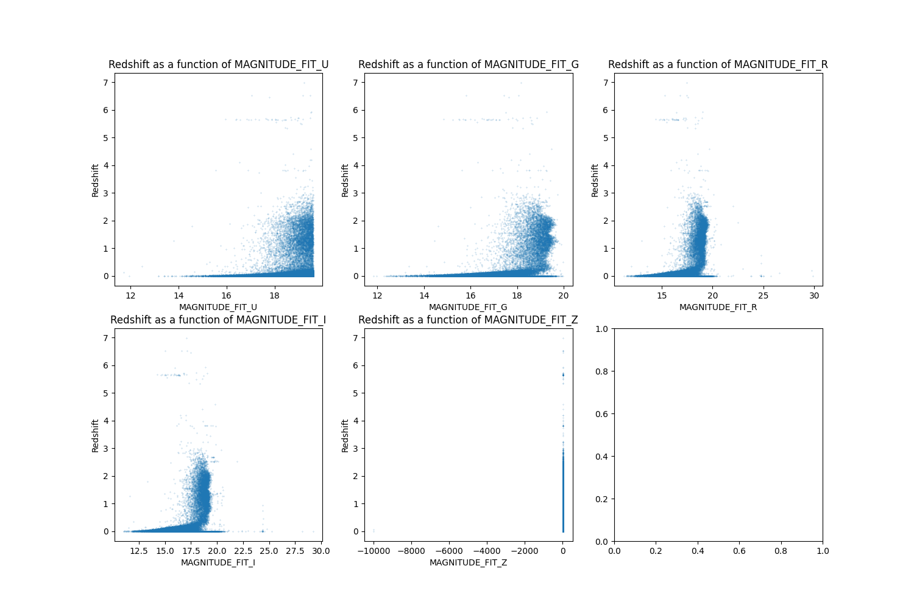
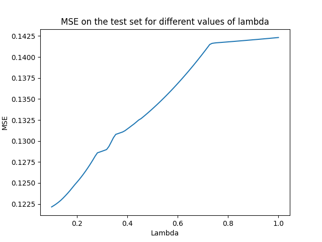

### MS&E 226 Project 1 report

#### 1 - Registration and staff meeting

- We acknowledge that we submitted the registration form 
- We met with Augustin on October 23th to validate the dataset

#### 2/3 - Dataset selection

The dataset we are going to use is the following : https://www.kaggle.com/datasets/diraf0/sloan-digital-sky-survey-dr18

This dataset is the result of the Sloan Digital Sky Survey, a study that archives and gathers the visible stellar objects and classifies them as Galaxies, Quasars, or Stars. 
- It has 43 columns and more than a hundred thousand rows.
- It contains many continuous covariates, and one categorical for the classification of the stellar object.
- It is not a time series.
- The data is gloablly clean and only a few to no values are missing, and there are a minor number of outliers to be removed. 
- The model relies on two astrophysical concepts:

The UBV photometric system (from Ultraviolet, Blue, and Visual), which can be broken down into five sets of photometric bands - u, g, r, i, z, namely ultraviolet band, green band, red band, infrared band, and near infrared band respectively. It consists in measuring the brightness of the light at different wavelengths. This system, also called the Johnson system, is a photometric system usually employed for classifying stars according to their measured colors.

Redshift, a key concept for astronomers, that reveals how an object in space is moving compared to us. It is a speed, and allows astronomors to measure the true distance between us and distant objects (in the past).

This dataset is publicly accessible and under the following license : https://creativecommons.org/licenses/by-sa/4.0/
We can use it for research purpose, and will only need to give appropriate credit if we publicly share our model.

- We acknowledge that we have reserved 20% of the rows of our dataset for the second part of the project

#### 4 - Outcome

For our continuous outcome, we will predict redshift, which is interesting because it determines how galaxies are distributed throughout the universe, informs us about the expansion rate of the cosmos, and contributes to our understanding of dark matter and dark energy. Additionally, redshift data can reveal galaxy properties and evolution, making it ideal for applying machine learning techniques to large datasets like the SDSS for insightful astrophysical discoveries.

For the categorical outcome, we'll be classifying whether a stellar object is a star or not. This classification is essential for astrophysical research, allowing scientists to study the properties and distribution of stars relative to other celestial objects. With a dataset like SDSS, which provides extensive data on various objects, machine learning can efficiently differentiate stars, aiding in large-scale cosmic surveys and contributing to our broader knowledge of stellar evolution and galaxy formation.

#### 5 - Data description and exploration

(a) Space studies have picked up a good pace for the past ten years with a massive expansion of earth telescopes like Hubble and space telescopes like the newly launched James Webb Space Telescope. Thus, massive amounts of data are collected everyday for us to understand better the contents of our universe. It is then important to know how to classify these objects in the best way possible, and how to characterize them using different properties. This is where machine learning comes into play: as stated before, classifiers and redshift predictions will contribute to a better understanding of the distant universe, which makes this dataset exciting to dive into.

(b) The data collection process for SDSS involves using a combination of optical and infrared imaging and spectroscopy to study celestial objects. Different phases of SDSS have used more and more advanced telescopes, instruments and techniques to improve data quality and expand the survey's scope. For example, the introduction of the Sloan 2.5 m telescope and the implementation of robotic fiber positioners (focal plane system) in SDSS-V (the current phase) aimed to improve efficiency and data quality.

A few issues with data collection can be outlined:

**Coordination**: Coordinating data collection from multiple telescopes and instruments in different locations is a complex task. It requires precise synchronization to ensure the accuracy and reliability of the data.

**Cross-Matching Catalogs**: Cross-matching of different input catalogs to ensure each object in the sky has a unique identifier, whose accuracy is crucial, as it affects the quality of the catalog and the identification of targets.

**Instrumentation**: Ensuring proper calibration, maintenance, and performance of new instruments and telescopes for accurate data collection.

**Data Accessibility**: Ensuring that data are accessible to the scientific public, including proper documentation. 

We started data exploration and plotted the redshift as a function of the different covariates (univariates analysis). 
We first plotted the redshift as a function of the "better fit DeV/Exp magnitude photometric band" for the five bands. Concretely, there exist two main distributions of the emitted light with regard to the width of the stellar object. "De Vaucouleurs" (DeV), a logarithmic distribution; and "Exponential Profile", and exponential distribution. "better fit DeV/Exp magnitude photometric band" fits both distributions and chooses the best fit. See the plot in the appendix.

As we can see, there are some outliers when plotting with regards to the z band.

We then plotted the redshift with regard to the Petrosian Radii, Petrosian Fluxes, Petrosian Half-Light Radii, and PSF Magnitude. Plots are visible in the appendix section

We spotted other outliers with the value -10000, so we decided to delete all the rows that contain values equal to -10000, as we think that they were an autofill for missing values.

(c) As we can see with the previous plots from the univariate analysis, the relationship between the magnitude of the photometric bands does not seem to be linear, but rather quadratic. This makes sense as most of the laws of physics, especially with energy related laws, are quadratic. This is why we will try to add quadratic-order features to some of our models.

(d) As we saw in the previous plot, the magnitude of the photometric bands seem highly correlated to the redshift. This is not suprising given the physics behind the problem: the "photometric redshift estimation". With Z being the redshift, there exists a function f with Z = f(u, g, r, i, z). The form of f is usually complicated and requires machine learning algorithm to be determined for each star.

The other parameters (Petrosian fluxes, radii, half-light radii, psf-magnitudes) also seem correlated to the outcome variable, which may indicate that overfitting will not be a problem.

The difference between the variance in the scatter plots between the left and the right sides of our graphs shows that our dataset is heteroskedastic, meaning variance of redshift depends on the value of the covariates. We will take this into account

(e) The magnitude of the photometric bands are dependent of the other parameters of the problem. With a pairplot, we also confirmed that these five bands seem highly positively correlated to each other (this is also logical given the physics of the problem - a brighter staller object will emit more at every wavelength).

(f) The subgroups of categories of measurements are obvious subgroups to be considered.

(g) Little to no data is missing, the dataset is rather complete. Yet, as explained before, this is because the missing data have been filled and equaled to -10 000. Thus, deleted each row of the dataset where at least one value is at -10000. This is ok because we still have a lot of data to work with.

#### Prediction - Regression

(a) The metric that we will use is the mean squared error on the test set. We will also compute the mean squared error on the training set in order to check for potential bias issues. Our goal will be to minimize the mean squared error in order to pick the best model.

(b) We first fitted an OLS using all covariates in order to have an idea of an acceptable performance. We computed the MSE for the train set and the test set. Using all covariantes, we will get a sense of which covariates to include, and which to engineer for future model computations. We got the following results:

INFO - Train MSE for OLS baseline model: 0.05544338714501912
INFO - Test MSE for OLS baseline model: 0.055813665090807256

As we can see, the two values are rather close, but the test MSE is bigger than the train MSE, which makes sense.
We will try to better these value using various different models.

(c) For regression, we have decided to implement a train-test split strategy for model evaluation with a 70% of the data for the train set. Given the substantial volume of our dataset, which could make the training of complex models like neural networks computationally intensive, a train-test split is a practical choice. We decided to not use cross-validation, because the benefit of using it diminishes since the train-test split will likely be representative of the data distribution, reducing the need for the redundancy in training that cross-validation provides

We will use random sampling to ensure that the split reflects the original distribution of classes. This is critical when dealing with imbalanced datasets and aims to preserve the percentage of samples for each class in both training and testing sets.

Additionally, we have a reserved holdout set for a later phase in the project. This will allow us to evaluate our model by computing indicators of how well our models will perform on unseen data before final deployment.

(d) We chose use four broad model strategies for the regression task.

- The first one is the baseline OLS that we chose to use as a baseline

- The second one is a Lasso with engineered features. In fact, as we saw in the previous plots, the relationship bewteen the magnitudes of the photometric bands and the redship does not look linear, but rather quadratic/expontential. This is why we engineered new covariates by taking the squared values of the "better fit DeV/Exp magnitude" covariates. We tried to run Lasso with different values of lambda (results will be given below).

- The third model we chose to train is a one-hidden-layer neural network. Predicting the redshift is a rather complicated part, as we explained earlier. We believe that a neural network will help us be more precise in fitting the model. After trial and error, we found that using LeakyReLU as an activation function was a better fit than a sigmoid or a hyperbolic tangent.

- The fourth model we chose two train is a multi-hidden-layer neural network. For regression we chose to use two hidden layers. We chose to train this model to check if we could improve the one-layer neural network by doing a more computationnaly intensive task. We chose LeakyReLU and Tanh as activation functions.

(e) We got the following results for our different models:

As we can see, the Lasso we trained (with a coefficient lambda = 0.3) has a big train & test MSE. 
We can also see that the multi layer model is the best model to fit our data. It is roughly twice as good as our baseline model, and it is intersting to see that the multi layer model performs better than the one layer model. This can be explained by the fact that the model function we are trying to find is extremely complex, so there is no problem of overfitting.

(f) As we saw, Lasso did not perform well. Though, we played with the regularization parameter to try and find a better option. It turns out the best option was lambda = 0. See the plot in the appendix

For Lasso, usually we have high bias if we are underfitting the model, which translates to both train and test MSE being high (the model does not capture all the complexities) ; and we have high variance if the train MSE is significantly lower than the test MSE, thus capturing noise.

As we saw with the results, Lasso train & test MSE are roughly similar. This leads us to believe that Lasso does not perform well due to high bias and underfitting. In fact, reducing the dimension of the problem by penalizing coefficients is not a good solution here.

(g) Given we take out the outliers from the holdout set, we expect nearly the same MSE as on the test set because we didn't perform a complicated model selection process (only at random), and the data collection is homogenous throughout the data set.

(h) We initially thought to only build a one layer neural network mode, but when we saw that it performed much better than the OLS baseline (which by the way also performed quite well), we considered adding a second layer to try and improve the MSe even more, and it worked. About the train-test split, it worked as expected, so we chose not to change anything with regard to this.

#### Prediction - Classification

(a) The metric that we will use is the accuracy on the test set. In order to do so, we performed a one hot encoding of the categorical variable "Class" that told us if the stellar object was a Star, a Quasar (QSO) or a Galaxy. We thus split this column into three columns (is_star, is_qso, and is_galaxy) with the value 1 if it is true, an 0 if it is not. We the train our models to try and match the true outcomes. Taking the mean of these results, we get our test accuracy (the maximum being 1).

(b) Like the regression part, we first fitted an OLS using all covariates in order to have an idea of an acceptable performance, and computed the accuracy. We got the following results:

Train accuracy for logistic regression model: 0.9222993523455112
Test accuracy for logistic regression model: 0.9213075060532687

As we can see, the two values are rather close, with the test accuracy being slightly lower than the train accuracy, which makes sense.
We also see that with OLS, only 92% of the obejcts are correctly classified as stars (we did not check which ones were false positives, and false negatives), so it is possible to improve our models with different methods.

(c) Likewise, we will use train-test split to train and evaluate the models we build.

(d) For classification, we chose to build three models:

- The first one is the OLS baseline that we previously showed. It is based on logistic regression, based on the model from sklearn.linear. In a few words, we run a linear regression model, and then we compute a logstic form of our fitted outcomes through a sigmoid function (that ranges from 0 to 1), and using a threshold, the output is either 0 or 1.

- The second one is a one layer neural network that works the same way as the one we used on regression, but gives out a 0 or a 1.

- The third one is a two layer neural network.

We chose to build a two layer neural network for the same reasons as before: as we will see later, the one layer neural network performed well, and we wanted to see if we could improve the model even more.

(e) We got the following results for our different models:

A first interesting result is that we don't actually have a best model, but rather, two best models. Both neural networks were correct in classifying stars 99.63% of the time. This is a huge improvement compared to the logistic regression baseline. 

Yet, adding multiple layers is not very useful because, since classification is a much simpler task than regression for finding the redshift, we evidently need far fewer parameters to faithfully represent the process: in a sense, the one layer neural network model is our best model.

As seen in our results, for every random 1000 stellar object measurements, 996 are classified correctly as stars or non-stars. Not only is it a good result, we we do not really care about misclassifying stellar objects (unlike credit card fraud for example), so we will stick with this results

(f) Our multi layer neural network is, paradoxically, the model that did not perform as well as our best model.

Indeed, given our results, we see that both of them also have the same accuracy on the train sets. Thus, the more complex deep network so it is somewhat overfit, in the sense that it was given more parameters than it needed to function properly. As we identified an issue of overftting, the bad performance is linked to a higher variance.

(g) Given we take out the outliers from the holdout set, we expect nearly the same error as on the test set because we didn't perform a complicated model selection process (only at random), and the data collection is homogenous throughout the data set.

(h) Initially, we thought of doing a decision tree classification or a random forest classification, but as our results with logistics regression were already very high, we decided to directly skip to neural networks to build efficient models.

#### Code upload
https://we.tl/t-WzebUwknfB

#### Appendix

##### Redshift as a function of multiple covariates

 

###### MSE in function of lambda for the Lasso method

